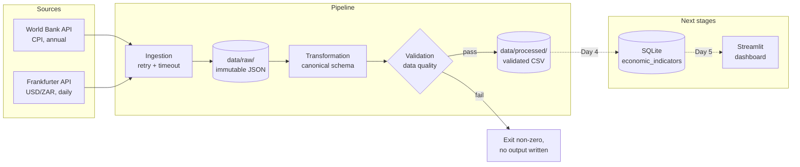

# SA Economic Data Pipeline

A batch data pipeline that ingests South African economic indicators from public
APIs, cleans and validates them into a single canonical schema, and (in later
stages) loads them into SQLite for analysis and visualization.

**Status:** 🟡 In progress — ingestion, transformation, and validation
implemented. Database loading and dashboard are in development.

---

## Table of contents

1. [Overview](#overview)
2. [Why this exists](#why-this-exists)
3. [Architecture](#architecture)
4. [Data sources](#data-sources)
5. [Pipeline stages](#pipeline-stages)
6. [Canonical schema](#canonical-schema)
7. [Project structure](#project-structure)
8. [Technologies](#technologies)
9. [Running locally](#running-locally)
10. [Running with Docker](#running-with-docker)
11. [Testing](#testing)
12. [Design decisions](#design-decisions)
13. [Known limitations](#known-limitations)
14. [Future improvements](#future-improvements)

---

## Overview

The pipeline pulls economic indicators for South Africa from two public
sources, normalizes them into a single observation table, validates the result
against a set of data-quality rules, and persists the output for downstream
analysis.

The end goal is a queryable store of South African economic indicators — CPI,
USD/ZAR exchange rate, and (optionally) fuel prices — with a dashboard that
shows trends over time.

**What this project demonstrates:**

- Batch ingestion from heterogeneous APIs with retry and timeout handling
- Response-shape validation (failing loudly when an API changes)
- Transformation into a canonical observation schema
- A data-quality validation layer that acts as the trust boundary before
  persistence
- Idempotent loading — running the pipeline twice produces the same database
  state as running it once
- Tested transformation and validation logic with boundary cases
- Containerized, single-command execution

---

## Why this exists

This project was built as a portfolio piece for a Data Engineering elective
application. It deliberately focuses on the parts of data engineering that
matter most in practice — reliability, idempotency, validation, and clear
separation of concerns — rather than on volume or framework novelty.

The two sources were chosen because they have **different shapes** (annual vs.
daily, different field names, different date formats). That means the pipeline
has to solve the real problem of unifying heterogeneous inputs, not a toy
problem where both sides already look the same.

---

## Architecture



**Reading this diagram:** raw data is immutable and never edited. Everything
downstream — cleaning, validation, loading — is reproducible from `data/raw/`.
If a transformation has a bug, you fix it and re-run; you don't re-fetch. That
property is the reason the raw/processed split exists.

---

## Data sources

| Source | Indicator | Frequency | API | Auth |
|---|---|---|---|---|
| [World Bank](https://data.worldbank.org/indicator/FP.CPI.TOTL) | CPI (`FP.CPI.TOTL`) | Annual | REST/JSON | None |
| [Frankfurter](https://www.frankfurter.app/) | USD → ZAR | Business days | REST/JSON | None |

**World Bank — CPI:** the canonical inflation indicator, published annually as
an index. Used here partly because it's clean and stable, and partly because
its annual frequency forces the pipeline to handle mixed-granularity data.

**Frankfurter — USD/ZAR:** daily reference rates sourced from the European
Central Bank. Keyless, well-documented, supports historical date-range queries
in a single call. Note: ECB publishes on business days only, so weekends and
holidays are absent — not zero. The pipeline treats these as gaps.

**Fuel prices:** deferred. There is no free, stable, keyless API for South
African fuel prices. See [`docs/decisions.md`](docs/decisions.md) §1 for the
reasoning.

---

## Pipeline stages

### 1. Ingestion

Fetches from each source and writes the raw response — unmodified — to
`data/raw/`, with a timestamped filename.

```bash
python -m src.pipeline.ingestion.run
```

- Every HTTP call goes through a shared session with 3 retries, exponential
  backoff, and a 30-second timeout.
- Responses are validated *before* being written. The World Bank API returns
  HTTP 200 with a null records field on certain errors; this is caught and
  raised rather than written as an empty file.
- Raw files are named `<source>_<UTC timestamp>.json`. Each run produces a new
  file; nothing is overwritten.

**Output:** two JSON files in `data/raw/`.

### 2. Transformation

Reads the latest raw file per source and normalizes both into one schema.

```bash
python -m src.pipeline.transformation.run
```

- World Bank records are filtered to ZAF, nulls are dropped, and annual dates
  are mapped to `YYYY-01-01`.
- Frankfurter records are flattened from `{date: {ZAR: value}}` into rows.
- Records that fail to parse are **counted and logged**, never silently
  dropped.
- The combined frame is de-duplicated on `(indicator_name, date, source)`.

**Output:** a validated CSV in `data/processed/`.

### 3. Validation

Runs before anything is written to `data/processed/`. If validation fails, the
pipeline exits non-zero and no output file is produced.

Checks performed:

- No null values in required columns
- All dates parse as ISO 8601
- All values are finite (no `NaN`, `inf`)
- No duplicate rows on the natural key
- All `source` values are known
- All `unit` values are non-empty

**Why this matters:** validation is the boundary between "we fetched something"
and "we trust this data." Nothing crosses it that hasn't passed.

### 4. Loading _(Day 4 — in progress)_

Loads the validated CSV into SQLite with `INSERT ... ON CONFLICT DO UPDATE`
keyed on `(indicator_name, date, source)`. Re-running the load is idempotent:
row counts do not change.

### 5. Dashboard _(Day 5 — planned)_

A Streamlit dashboard showing CPI and USD/ZAR trends over time, with a data
quality summary.

---

## Canonical schema

Both sources are transformed into this shape before validation and loading:

| Column | Type | Description | Example |
|---|---|---|---|
| `indicator_name` | string | Short indicator code | `CPI`, `USD_ZAR` |
| `date` | string (ISO 8601) | Observation date | `2024-01-01` |
| `value` | float | The measured value | `158.3` |
| `unit` | string | What the value means | `index_2010_100`, `ZAR_per_USD` |
| `source` | string | Origin of the data | `world_bank`, `frankfurter` |

**Why one shape:** so the loader, the validator, the tests, and the dashboard
don't need to know which source a row came from. One shape means one code path.

**Why `unit` is stored with the data:** because "value = 5.2" is meaningless
without knowing whether that's a percent, an index, or a currency ratio. Units
belong with the observations, not in a lookup table that can drift.

**Annual CPI dates:** the World Bank publishes CPI as an annual average. It's
mapped to `YYYY-01-01`, matching the World Bank's own portal convention. A
naive date-based join between CPI and FX will miss because CPI is annual and
FX is daily — the dashboard joins on **year**, not on date. See
[`docs/decisions.md`](docs/decisions.md) §12.

---

## Project structure

```text
sa-economic-data-pipeline/
├── README.md
├── requirements.txt
├── pyproject.toml                 # pytest config
├── .gitignore
├── .env.example
├── src/
│   └── pipeline/
│       ├── ingestion/             # fetch + persist raw
│       │   ├── http.py            # retry/timeout session
│       │   ├── raw.py             # timestamped raw writer
│       │   ├── world_bank.py      # CPI fetcher + validator
│       │   ├── frankfurter.py     # FX fetcher + validator
│       │   └── run.py             # CLI entrypoint
│       ├── transformation/        # raw → canonical shape
│       │   ├── clean_data.py
│       │   └── run.py
│       ├── validation/            # data-quality trust boundary
│       │   └── validators.py
│       └── storage/               # (Day 4) SQLite loader
├── data/
│   ├── raw/                       # immutable, timestamped API responses
│   └── processed/                 # validated CSVs
├── dashboard/                     # (Day 5) Streamlit app
├── scripts/                       # one-off utilities
├── tests/                         # pytest suite
└── docs/
    ├── decisions.md               # design rationale + tradeoffs
    └── architecture.md            # (Day 6) diagrams
```

---

## Technologies

| Layer | Choice | Why |
|---|---|---|
| Language | Python 3.11+ | Standard for data pipelines; matches the rest of the portfolio |
| HTTP | `requests` + `urllib3.Retry` | Retry-on-transient-failure, explicit timeouts |
| Data manipulation | `pandas` | Small enough datasets that pandas is the right tool; no need for Spark/polars |
| Storage | SQLite | Single-writer analytical workload, small dataset, zero moving parts in the demo. See [`docs/decisions.md`](docs/decisions.md) §2 |
| Testing | `pytest` | Boundary-case tests on transform + validation |
| Containerization | Docker + Compose | `docker compose up` runs the pipeline end-to-end |
| CI | GitHub Actions | Runs tests on every push |

---

## Running locally

### Prerequisites

- Python 3.11+
- Git

### Setup

```bash
git clone https://github.com/<you>/sa-economic-data-pipeline.git
cd sa-economic-data-pipeline

python -m venv .venv
source .venv/bin/activate          # Windows: .venv\Scripts\activate
pip install -r requirements.txt
```

### Run the pipeline

```bash
# Stage 1: fetch raw data from both sources
python -m src.pipeline.ingestion.run

# Stage 2: transform + validate + write processed output
python -m src.pipeline.transformation.run
```

**Expected output (abridged):**

```text
INFO src.pipeline.ingestion.http: GET https://api.worldbank.org/v2/country/ZAF/indicator/FP.CPI.TOTL
INFO src.pipeline.ingestion.http: HTTP 200 (12xxx bytes)
INFO src.pipeline.ingestion.world_bank: World Bank CPI: 65 records returned
INFO src.pipeline.ingestion.raw: Saved raw file: data/raw/world_bank_cpi_20260914T...Z.json
INFO src.pipeline.ingestion.frankfurter: Frankfurter USD/ZAR: 16xx observations
INFO src.pipeline.ingestion.raw: Saved raw file: data/raw/frankfurter_USD_ZAR_...json
INFO pipeline.ingestion: Ingestion complete

INFO pipeline.transformation: Using CPI raw file: world_bank_cpi_...
INFO src.pipeline.transformation.clean_data: CPI: kept=65 skipped(non-ZA=0 null=0 bad=0)
INFO src.pipeline.transformation.clean_data: FX: kept=16xx skipped(missing-quote=0 bad=0)
INFO src.pipeline.validation.validators: Validation passed: 17xx rows, 2 indicators
INFO pipeline.transformation: Wrote 17xx rows to data/processed/economic_indicators_...Z.csv
```

### Verify the output

```bash
ls -la data/raw/
ls -la data/processed/
head -3 data/processed/economic_indicators_*.csv
```

---

## Running with Docker

_(Day 4 — Dockerfile and compose file will be added alongside the database
stage. The intent is that `docker compose up` runs ingestion → transformation →
load in one command, with the SQLite file persisted to a named volume.)_

---

## Testing

```bash
pytest -v
```

**Coverage by area:**

| Area | Tests |
|---|---|
| Ingestion — World Bank | empty records, null records, valid payload, raw file written |
| Ingestion — Frankfurter | missing `rates` key, wrong quote currency, raw file written |
| Transformation — CPI | canonical schema, null values dropped, non-ZA rows dropped |
| Transformation — FX | canonical schema, missing-quote rows skipped |
| Transformation — combine | de-duplication on natural key, determinism |
| Validation | empty input, null values, duplicate keys, unknown source, bad dates |

Tests mock the HTTP layer — no network access required.

**Philosophy:** every test targets a specific failure mode, not "does the code
run." A test that would still pass if the function returned an empty DataFrame
isn't a test.

---

## Design decisions

Full rationale and tradeoffs are in [`docs/decisions.md`](docs/decisions.md).
Highlights:

- **[§2](docs/decisions.md#2-storage-sqlite-instead-of-postgresql)** — Why
  SQLite, and when that would be the wrong choice.
- **[§3](docs/decisions.md#3-raw--processed-split)** — Why raw is immutable and
  processed is reproducible.
- **[§4](docs/decisions.md#4-idempotent-loads)** — Why re-running the pipeline
  must not change the database.
- **[§5](docs/decisions.md#5-schema)** — Why one observation table instead of
  one table per indicator.
- **[§11–13](docs/decisions.md)** — Canonical schema, annual CPI dating, and the
  "count dropped records, don't ignore them" policy.

**The rule for this project:** nothing gets built that can't be explained.
Every architectural choice has a written rationale, including the ones where
the choice was "less, deliberately."

---

## Known limitations

Honest list of what this pipeline does _not_ do:

1. **No imputation.** Weekend FX gaps stay as gaps. The dashboard shows them
   as gaps; nothing is filled in silently.
2. **No backfill beyond what the APIs return.** The pipeline fetches a fixed
   historical window on first run — not "everything since 1960."
3. **No frequency column.** Annual and daily series share one table;
   frequency is implied by the indicator. This works for two indicators; it
   would not scale to ten.
4. **No alerting.** A failed fetch logs and exits non-zero. There is no
   Slack/email notification. For a manually-run batch job, that is correct.
5. **SQLite file lives in a Docker volume.** If the volume is removed, the
   database is gone — but the pipeline rebuilds it from `data/raw/`, which is
   exactly the point of keeping raw immutable.
6. **Single-run inference.** The transformation stage uses the latest raw file
   per source. A scheduled version would track a watermark instead.

---

## Future improvements

Ordered roughly by how much value they'd add:

1. **Incremental ingestion** — track a `last_fetched` watermark so re-runs
   don't re-download the full history.
2. **Docker Compose for the full pipeline** — a single `docker compose up`
   that runs all stages and serves the dashboard.
3. **CI on GitHub Actions** — `pytest` on every push, green check on `main`.
4. **Fuel prices** — add via a documented manual CSV with a refresh script.
5. **Storage-layer abstraction** — a thin DB module so swapping SQLite →
   Postgres is a connection-string change, not a rewrite.
6. **dbt for transformation** — only if the transformation logic grows past
   what fits comfortably in pandas. At current size, dbt would add a
   dependency and a build step to replace code that already has tests.
7. **Orchestration** — Airflow/Prefect, only if the pipeline grows beyond the
   current three stages and needs scheduling, retries, and dependency
   management across runs.

**Explicitly not planned:** streaming (both sources are batch), cloud
deployment (not what this project is demonstrating), ML/forecasting (out of
scope — a naive forecast would imply rigor the pipeline doesn't have).

---

## License

MIT — see `LICENSE` if present, otherwise this project is provided as-is for
portfolio and evaluation purposes.
```
