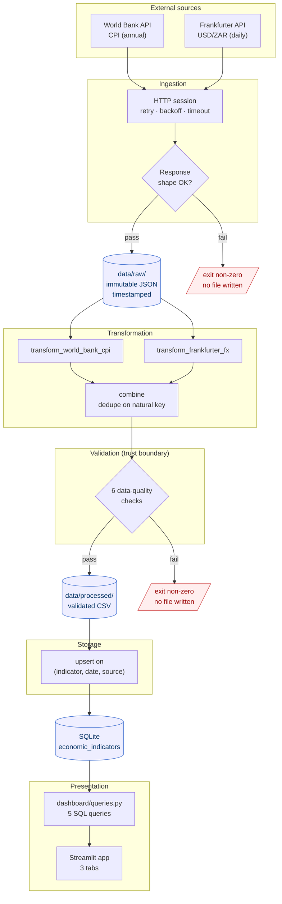

# Architecture

## Overview

The pipeline is a linear batch flow with a single trust boundary. Data flows
one direction — source → raw → transformed → validated → loaded → visualized —
and at no point does a downstream stage write back to an upstream one.

## Stage responsibilities

| Stage | Input | Output | Failure mode |
|---|---|---|---|
| Ingestion | HTTP endpoints | Timestamped JSON in `data/raw/` | Non-2xx after 3 retries, or response shape mismatch → raise, nothing written |
| Transformation | Latest raw JSON per source | In-memory DataFrame in canonical schema | Unparseable rows are dropped and counted |
| Validation | Canonical DataFrame | Same DataFrame, or raise | Any check fails → raise, nothing written |
| Storage | Validated CSV | Rows in SQLite | Constraint violation → raise, transaction rolled back |
| Presentation | SQLite file | Streamlit UI | DB missing → error message with the commands to fix it |

## The trust boundary

Validation is the boundary between "we fetched something" and "we trust this
data." Nothing crosses it that hasn't passed all six checks:

1. No nulls in required columns
2. All dates parse as ISO 8601
3. All values are finite
4. No duplicate rows on the natural key `(indicator_name, date, source)`
5. All `source` values are known
6. All `unit` values are non-empty

The pipeline exits non-zero if validation fails, and `data/processed/` is not
written. This is deliberate: a partially-written processed file is worse than
no file, because downstream stages can't tell the difference between "complete
dataset" and "half of it."

## Idempotency

Running the full pipeline twice produces the same database state as running it
once. The mechanism:

- Every observation has a natural key: `(indicator_name, date, source)`.
- Loads use `INSERT ... ON CONFLICT(key) DO UPDATE SET value = excluded.value, updated_at = CURRENT_TIMESTAMP`.
- `tests/test_storage.py::test_load_is_idempotent` runs the load twice against
  a temp DB and asserts the row count is unchanged.

**Why this matters:** batch pipelines run on schedules. A cron job that fires
twice because of a retry, or a manual re-run after a fix, must not corrupt the
table. Idempotency is the property that makes a pipeline safe to re-run, which
is the property that makes it safe to operate.

## Why raw is immutable

`data/raw/` files are never modified. If a transformation has a bug, you fix
it and re-run transformation against the same raw file — you don't re-fetch.
This is what makes the pipeline reproducible.

Each run writes a new timestamped file, so the history of what each source
returned is preserved on disk. If the World Bank revises CPI for 2022 next
month, you'll have both versions, and you can see exactly what changed.

## Component boundaries

| Component | Knows about | Deliberately doesn't know |
|---|---|---|
| `ingestion/` | HTTP, JSON shapes of specific sources | Canonical schema, DB |
| `transformation/` | Canonical schema, source JSON shapes | DB, HTTP |
| `validation/` | Canonical schema | Where data came from, where it goes |
| `storage/` | Canonical schema, SQLite | HTTP, source JSON shapes |
| `dashboard/` | SQLite schema | Everything upstream |

Each boundary is a directory. Nothing imports across a boundary except the
canonical-schema DataFrame, which is the shared contract.

**Consequence:** the ingestion layer could be replaced with a Kafka consumer,
or the dashboard with a REST API, without touching anything else. That's the
whole point of the boundaries.