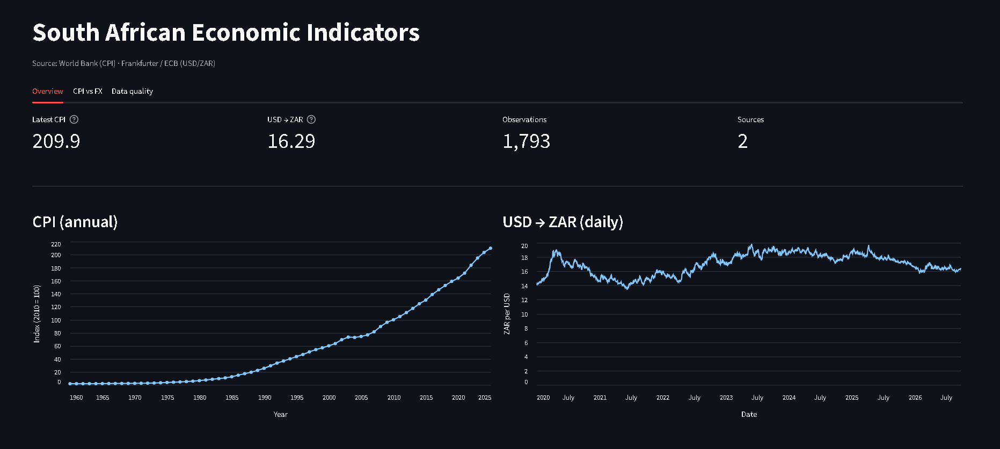
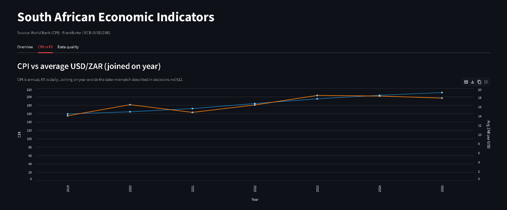
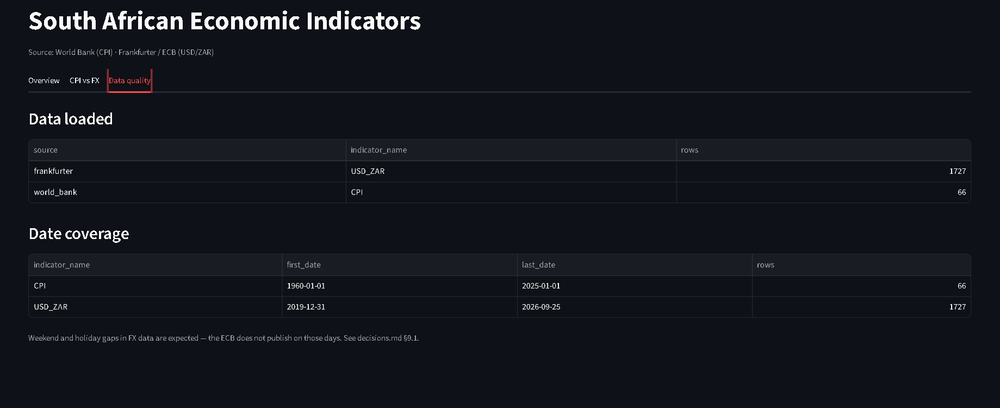

# Demo

Screenshots of the running dashboard. To reproduce locally, see the
[Running locally](../README.md#running-locally) section of the README.

## Overview tab



Four metric cards (latest CPI, latest USD→ZAR, total observations, source
count), followed by two time series. The CPI chart starts in the 1960s and
uses the World Bank's full historical series; the FX chart covers the window
configured at ingestion (`--fx-start`, default 2020-01-01).

**What it demonstrates:** the pipeline ingests and loads heterogeneous
frequencies into a single queryable store, and the dashboard renders each
indicator on its own appropriate time axis.

## CPI vs FX tab



CPI and average USD/ZAR joined **on year**, plotted on dual y-axes. The
year-join is deliberate — CPI is annual and FX is daily, so a date-based
join would produce no matching rows. See
[decisions.md §12](decisions.md) for the reasoning.

**What it demonstrates:** the schema and query layer handle mixed-frequency
data without fudging either series into the other's shape.

## Data quality tab



Two tables: rows loaded grouped by source and indicator, and date coverage
per indicator. The caption notes that weekend and holiday gaps in the FX
series are expected — the ECB does not publish on those days, and the
pipeline does not impute them.

**What it demonstrates:** the pipeline's output is auditable. Anyone can see
exactly what was loaded, from where, and over what date range, without
opening the database.

## Reproducing

```bash
git clone https://github.com/<you>/sa-economic-data-pipeline.git
cd sa-economic-data-pipeline

python -m venv .venv
source .venv/bin/activate          # Windows: .venv\Scripts\activate
pip install -r requirements.txt

python -m src.pipeline.ingestion.run
python -m src.pipeline.transformation.run
python -m src.pipeline.storage.run

streamlit run dashboard/app.py
```

Or with Docker:

```bash
docker compose up
```